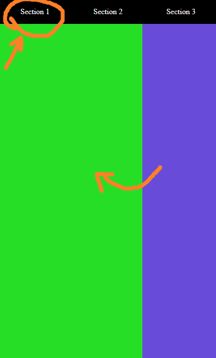
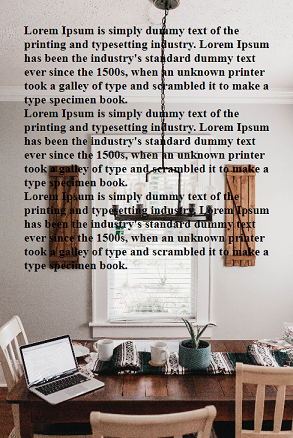

# Angular Resources

This project was created for developers who need basic components and for contribute to the community that get me a lot.

Este proyecto fue creado  para desarrolladores que necesiten componentes basicos y para la comunidad que me da mucho.

# Components

### 001 - Slide

Route: /001

Slide (touch & responsive) using "scroll-snap-type: x mandatory", "scroll-behavior: smooth" and and buttons for change between the slides

### 002 - Background with image

Route: /002

Component responsive using css grid and background image dinamically 

